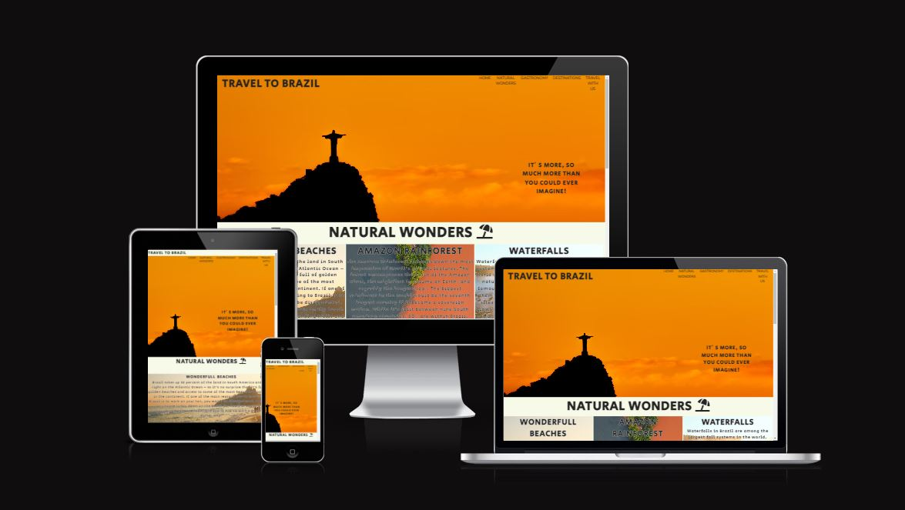
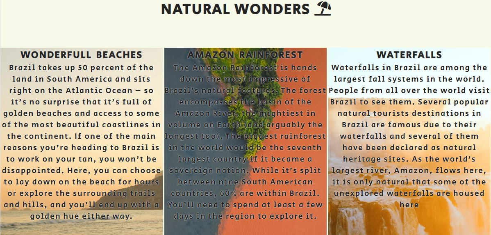
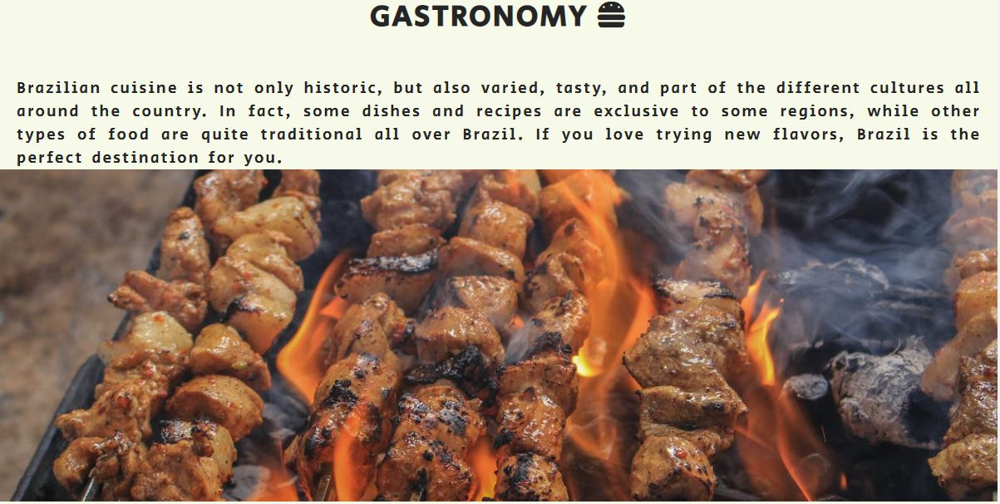
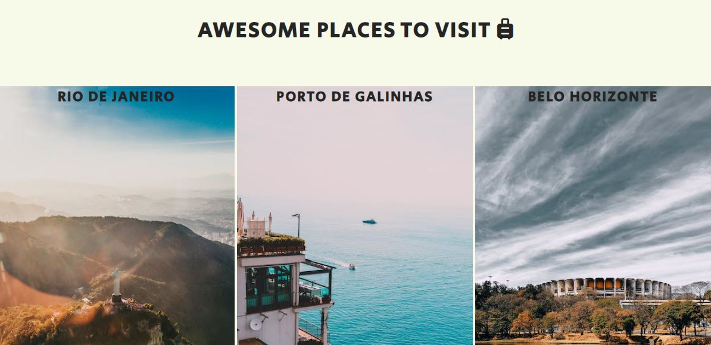
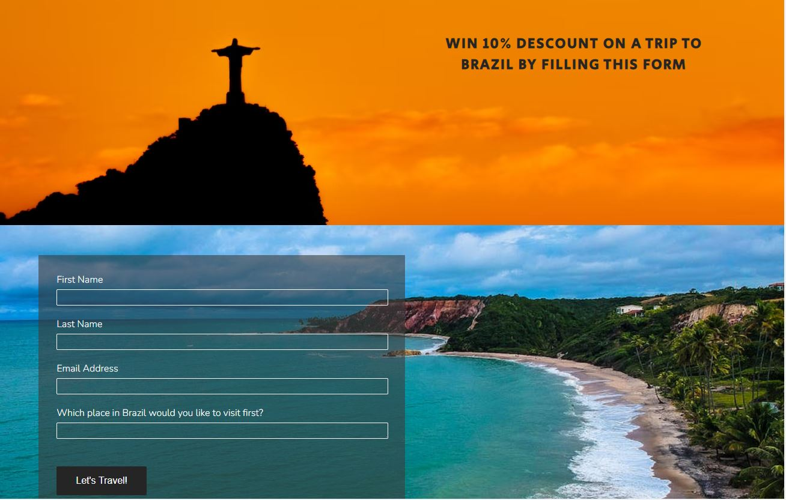
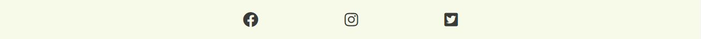
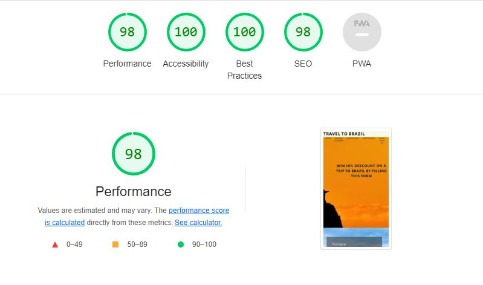

# Travel to Brazil

Travel to Brazil is a website for people who are looking for a destination to spend their vacations or holidays. It presents a wonderful travel option, one of the most beautiful countries in South America. The website provides information on natural beauties, type of cuisine and tips on places to visit.

The website also provides a discount coupon for travel packages to Brazil. The site contains only two pages, making it easy to view on any device.

At the end we have links directing to our social media, where we give more information and tips to help travelers.

# Features  

- __Navigation__

    - Featured at the top of the page, the navigation shows the page`s name in the left corner. TRAVEL TO BRAZIL that links to the top of the page.

    - The other navigation links are to the right "Home, Natural Wonders, Gastronomy, Destionations" which link to different sections of the same page.

    - The last navigation link furter to the right "Travel With Us" link to the second page of the website, the page that contain a form.

    - The navigation allow the user to easily find the different sections of the site

- __Hero Image Section__

    - This section shows a background image and a cover text to encourage the user to continue viewing the site.

    - The background image is of the most beautiful tourist spot in the city of Rio de Janeiro, already showing the user that the site will show the best places in Brazil

- __Natural Wonders Section__
    
    - This section shows the user three great types of wonders of nature that Brazil has to offer.

    - The three pieces of information are aligned next to each other, with a background image each and an explanatory text about each one, allowing the user to understand a little about each one.

    - On the left, the user can read more about the wonderful beaches that are found in Brazilian territory.

    - On the right, the user can also read about the huge waterfalls in the country. Giving another option to attract the user.

    - In the middle there is an explanation about the largest forest in the world, the Amazon rainforest.

- __Gastronomy Section__

    - This section talks a little about Brazilian cuisine, known worldwide for its incredible variety and flavors.

    - Right below the section title we can identify the explanatory text, easy to understand by the user.

    - Below the text there is a large image of one of the most famous foods in Brazil, the Brazilian barbecue. The image is striking and draws attention to the user's curiosity and desire.

- __Destinations Section__

    - This section of the site gives users tips on places to visit in Brazil.

    - The section is divided into three parts, each containing the name of a city and a corresponding photo.

    - This section helps the user to have a quick idea of ​​where he would like to visit within Brazil.

- __Form Section__

    - This section allows the user to earn a discount for a travel package to Brazil.

    - Developed on a different page, it is easy to access and has striking images and a large form that is easy for the user to view.

    - The form fields and the submit button have a hover style, making it even easier for the user to interact with the site.

- __Footer Section__

    - This section contains icons from our social networks where we explain and give more tips for traveling to Brazil.

    - Each icon contains a link that directs the user to the respective social network.

    - The links are opened on a different page, it is not necessary for the user to leave the site

# Testing

- I tested that this page works in different browsers: Chrome, Firefox, Safari.

- I confirmed that this project is responsive, looks good and functions on all standard screen sizes using the devtools devide toolbar.

- I confirmed that the navigation links all works.

- I confirmed that the text of the website are all readable and easy to understand.

- I have confirmed that the form works: requires entries in the first three fields, will only accept an email in the email field, and the submit button works.

# Fixed Bugs

- The site was not responsive, and the images and text were not acting correctly after scaling the page.

- The cause of the problem was using to much float and using padding the wrong way.

- After using flexbox and percentages  the website got much better.

# Validator Testing

- __HTML__

    - No erros were returned when passing through the official W3C validator.

- __CSS__

    - No erros were found when passing through the official (Jigsaw) validator.

- __Accessibility__

    - I confirmed that the colors and fonts chosen are easy to read and accessible by running it through lighthouse in devtools.

# Unfixed Bugs

- No unfixed bugs.

      

